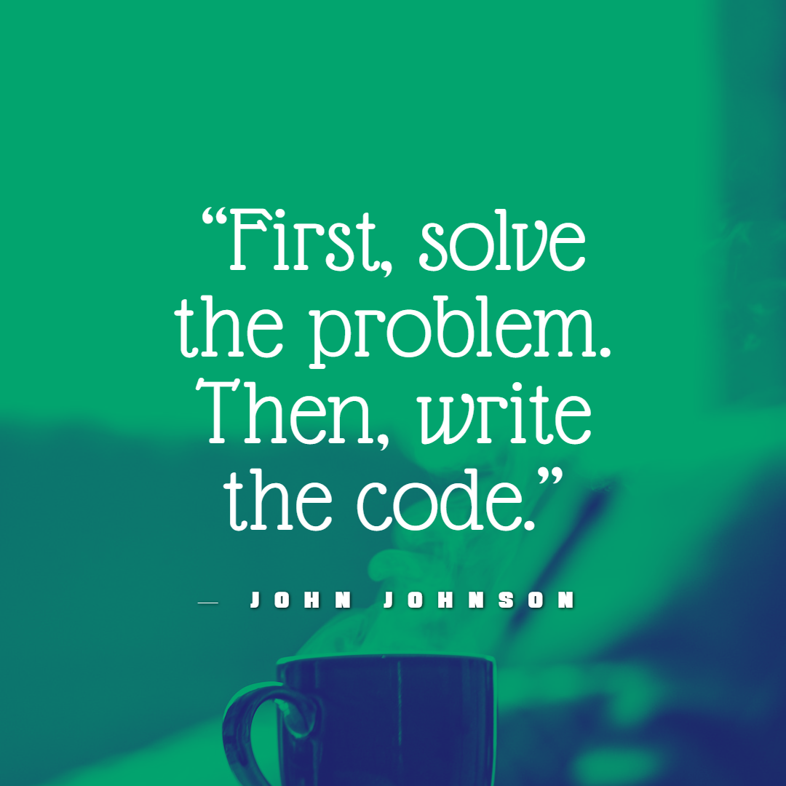

  

<h1 align="center">Hi 👋, I'm Irfan Shaikh</h1>
<h3 align="center">🚀 ML Enthusiast | Python Developer | Exploring GenAI, Deep Learning & LLMs</h3>

  

---

### 💡 About Me

- 🤖 Building smart things with code — ML, GenAI, LLMs
- 🧠 Passionate about AI, Deep Learning, NLP, and Transformers
- 🛠️ Tech Stack: Python, PyTorch, TensorFlow, Hugging Face, Pandas, NumPy
- 🌱 Currently diving deeper into LLM fine-tuning & AI-powered apps
- 📊 Active on [Kaggle](https://www.kaggle.com/irfan911) sharing notebooks & insights
- 💬 Ask me about machine learning projects, GenAI, or open-source
- 🎯 Goal: Create AI solutions that make real-world impact

---

### 🔗 Connect With Me

---

### 📊 GitHub Stats

  
  

---

### 🧠 Top Skills & Tools

---

### 🚀 Latest Projects

- 🌍 **Machine Translation** – Built from scratch using PyTorch Transformer, translating English to Hindi
- 🖼️ **Image Captioning** – Deep learning model to generate captions from uploaded images using CNN + RNN
- 💧 **Water Potability Detection (Full Stack)** – ML backend + full web UI for classifying drinkable water
- 🧾 **Autogradr** – AI-powered auto-grading system with rubric-based scoring, feedback, and teacher review

---

> “Code like a scientist. Think like an artist. Build like an engineer.” 💡

---

<!--  -->

  

